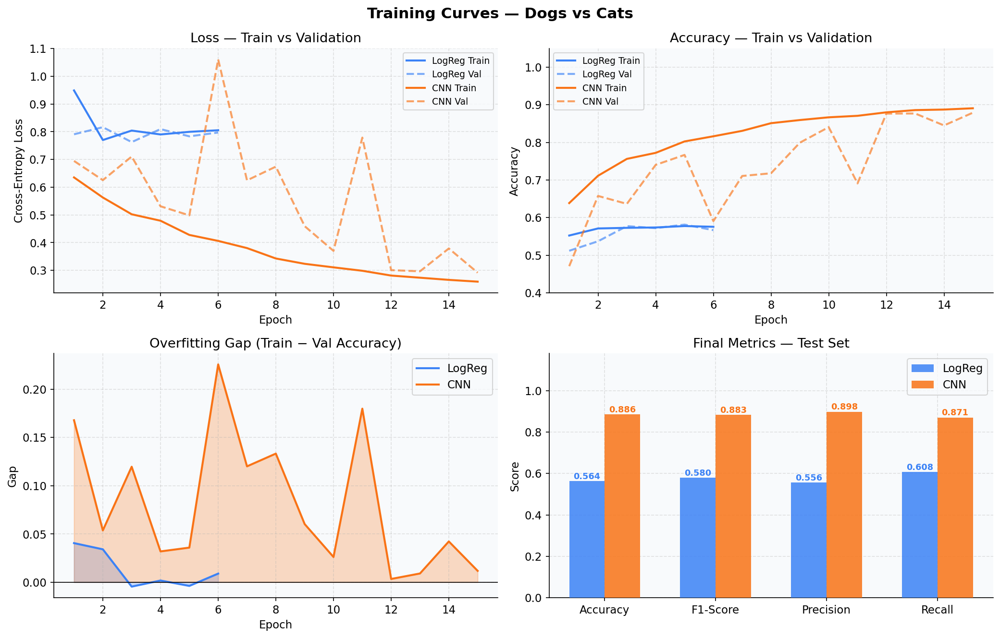
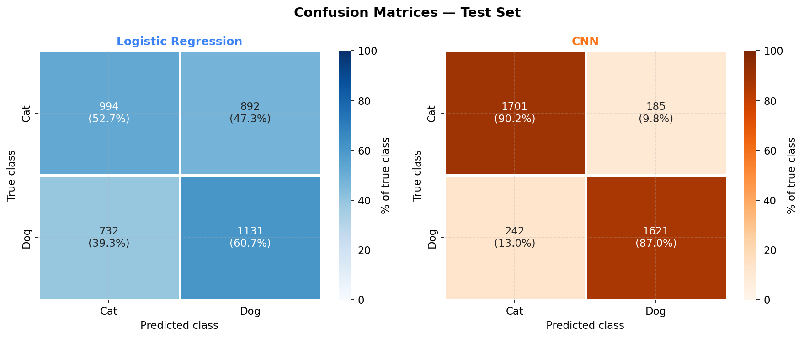
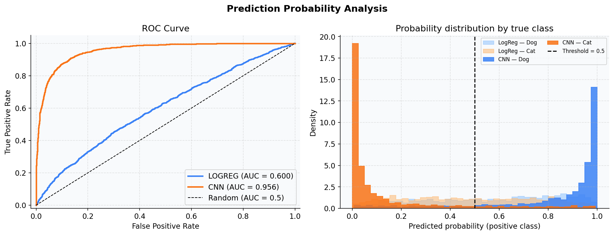

<div align="center">

# 🐱 Dogs vs Cats — Computer Vision Benchmark

### Comparing a Logistic Regression baseline against a custom 4-block CNN, end-to-end with PyTorch Lightning.

[](https://www.python.org/downloads/)
[](https://pytorch.org/)
[](https://lightning.ai/)
[](LICENSE)
[](https://github.com/psf/black)
[](https://github.com/astral-sh/ruff)
[](.github/workflows/ci.yml)
[](tests/)
[](https://huggingface.co/spaces/Yobapatrick/dogs-vs-cats)

<br/>

**CNN: 90.1% accuracy · AUC 0.965**  |  **Baseline LogReg: 58.7% · AUC 0.623**

*A ~31-point accuracy gap that quantifies exactly what convolutional inductive bias buys you on natural images.*

</div>

---

## 📌 Table of Contents

- [Project Overview](#-project-overview)
- [Results at a Glance](#-results-at-a-glance)
- [Why This Project](#-why-this-project)
- [Dataset](#-dataset)
- [Methodology](#-methodology)
- [Repository Architecture](#-repository-architecture)
- [Installation & Setup](#-installation--setup)
- [Usage](#-usage)
- [Detailed Results & Analysis](#-detailed-results--analysis)
- [Tech Stack & Skills Demonstrated](#-tech-stack--skills-demonstrated)
- [Engineering Practices](#-engineering-practices)
- [Roadmap & Improvements](#-roadmap--improvements)
- [License](#-license)

---

## 🎯 Project Overview

End-to-end binary image classification (cat vs dog) treated as a **rigorous head-to-head experiment** rather than a "build one model that works" exercise. Two models are trained on **identical data, identical loss, identical trainer** — the only thing that changes is the architecture. This isolates the contribution of convolutional inductive bias on natural images.

**What this repo demonstrates:**

- 🔬 **Scientific comparison** — Logistic Regression on flattened pixels as a floor, vs. a custom CNN as the target.
- 🧱 **Production-grade structure** — modular Python package (`src/`), YAML-driven configs, CLI scripts, unit tests, CI, Docker.
- 📊 **Comprehensive evaluation** — accuracy / F1 / precision / recall, confusion matrices, ROC, probability calibration, and a qualitative error gallery.
- ⚡ **PyTorch Lightning** — clean separation between research logic (`LightningModule`) and engineering (`Trainer`, callbacks).

> 📖 For methodology details and result interpretation, see [`docs/METHODOLOGY.md`](docs/METHODOLOGY.md).

---

## 🏆 Results at a Glance

| Metric | Logistic Regression | **CNN** | Δ (absolute) |
|:---|:---:|:---:|:---:|
| **Accuracy** | 0.587 | **0.901** | +31.4% |
| **F1-Score** | 0.557 | **0.897** | +34.0% |
| **Precision** | 0.596 | **0.906** | +31.0% |
| **Recall** | 0.530 | **0.893** | +36.3% |
| **ROC-AUC** | 0.623 | **0.965** | +0.342 |

<div align="center">
  
  <br/><em>Figure 1 — Loss, accuracy, overfitting gap, and final metrics for both models.</em>
</div>

<br/>

<div align="center">
  
  <br/><em>Figure 2 — The CNN is symmetric (≈9% error each side); LogReg confuses dogs as cats ~47% of the time.</em>
</div>

<br/>

<div align="center">
  
  <br/><em>Figure 3 — ROC AUC 0.965 vs 0.623 and the bimodal vs near-uniform probability distributions.</em>
</div>

**The TL;DR**: a linear classifier on raw pixels lives just above random; replacing it with a small CNN — same data, same loss, same trainer — closes most of the gap to a human-level decision.

---

## 🎮 Try the Live Demo

A Streamlit app runs both models side-by-side on any image you upload — no install required.

[](https://huggingface.co/spaces/Yobapatrick/dogs-vs-cats)

Or run it yourself:

```bash
pip install -r app/requirements.txt
streamlit run app/streamlit_app.py
```

The interesting part isn't watching the CNN get things right — it's watching the **disagreement cases**, where the baseline votes one way and the CNN the other. Those are the images where pixel intensity alone is misleading and spatial structure does the work.

> 📖 Deployment instructions: [`app/README.md`](app/README.md)

---

## 💡 Why This Project

Image classification is a solved problem at the textbook level. This repo's value is **not** in beating a benchmark — it's in showing how I'd structure a real applied-ML investigation:

1. **Frame the question precisely**: not "can a model classify cats and dogs", but "how much of the task does the architecture do versus the pixels".
2. **Build a floor and a ceiling**, then measure the gap.
3. **Make the comparison fair** — shared trainer, shared metric stack, shared data pipeline. Anything else is comparing apples to a different fruit.
4. **Ship a repo that another engineer can run** — not a single notebook, but configs, tests, CI, and a CLI.

---

## 📦 Dataset

- **Source**: [Dog and Cat Classification — Kaggle](https://www.kaggle.com/datasets/bhavikjikadara/dog-and-cat-classification-dataset)
- **Format**: `ImageFolder` layout, two balanced classes (`cat/`, `dog/`)
- **Image size used**: 64×64 (resized + normalized with ImageNet statistics)
- **Splits**: 70% train · 15% val · 15% test (seeded for reproducibility)
- **Augmentation** (train only): `RandomHorizontalFlip` · `RandomRotation(10°)` · `ColorJitter(0.2)`

> 📥 The dataset is downloaded automatically via `kagglehub` — no manual step required. See [`src/data/download.py`](src/data/download.py).

---

## 🧪 Methodology

### Two models, one trainer

Both models inherit from a shared `BaseClassifier` (`src/models/base.py`) that owns the loss, the `torchmetrics` stack, and per-epoch history tracking. This is the contract that makes the comparison meaningful:

```text
                  BaseClassifier (Lightning)
                ┌───────────┴───────────┐
            LogRegModel              CNNModel
        Linear(12288 → 2)      4 conv blocks + head
```

| Aspect | Logistic Regression | CNN |
|---|---|---|
| Parameters | ~12k | ~390k |
| Inductive bias | None (flat) | Translation equivariance, locality, hierarchy |
| Optimizer | Adam | AdamW (weight_decay 1e-4) |
| Scheduler | — | CosineAnnealingLR |
| Regularization | — | BatchNorm + Dropout 0.4 + weight decay |

### Training protocol

- **Max 15 epochs**, batch size 64
- **EarlyStopping** on `val_loss` (patience 4) — both models stop themselves
- **ModelCheckpoint** keeps the best `val_acc` epoch
- **`pl.seed_everything(42, workers=True)`** — reproducible end-to-end

### Evaluation

Five quantitative metrics (accuracy, F1, precision, recall, ROC-AUC), confusion matrices, ROC curves, and a **qualitative error gallery** showing the actual images each model got wrong. Defining the metrics once on `BaseClassifier` keeps the comparison strictly symmetric.

---

## 🏗️ Repository Architecture

```
dogs-vs-cats/
├── 📁 configs/                      # YAML-driven experiment configs
│   ├── base.yaml                    # Shared defaults
│   ├── logreg.yaml                  # Baseline experiment
│   └── cnn.yaml                     # CNN experiment
│
├── 📁 src/                          # Importable Python package
│   ├── data/
│   │   ├── download.py              # Kaggle Hub fetcher
│   │   └── datamodule.py            # LightningDataModule
│   ├── models/
│   │   ├── base.py                  # Shared BaseClassifier
│   │   ├── logreg.py                # Linear baseline
│   │   ├── cnn.py                   # 4-block CNN
│   │   └── __init__.py              # build_model() factory
│   ├── training/
│   │   ├── callbacks.py             # EarlyStopping, Checkpoint, LR Monitor
│   │   └── trainer.py               # Config-driven run_experiment()
│   ├── evaluation/
│   │   ├── metrics.py               # Predictions, ROC, confusion matrix
│   │   └── visualizations.py        # 4 plotting routines
│   ├── inference/
│   │   └── predict.py               # Predictor class + from_checkpoint()
│   └── utils/
│       ├── config.py                # YAML loader w/ inheritance
│       ├── logging.py               # Structured logging
│       └── seed.py                  # Reproducibility helpers
│
├── 📁 scripts/                      # CLI entry points
│   ├── train.py                     # python scripts/train.py --config ...
│   ├── evaluate.py                  # Generates the full visual report
│   └── predict.py                   # Single/batch inference
│
├── 📁 notebooks/                    # Storytelling notebooks
│   ├── 01_eda.ipynb                 # Dataset exploration
│   ├── 02_baseline_logreg.ipynb     # Baseline training
│   ├── 03_cnn_training.ipynb        # CNN training
│   └── 04_model_comparison.ipynb    # Side-by-side analysis
│
├── 📁 tests/                        # 14 unit tests, 95% coverage on DataModule
│   ├── test_datamodule.py
│   ├── test_models.py
│   └── test_inference.py
│
├── 📁 app/                          # 🎮 Streamlit live demo (HF Spaces ready)
│   ├── streamlit_app.py             # Side-by-side LogReg vs CNN inference
│   ├── requirements.txt             # Demo-only deps (no training stack needed)
│   └── README.md                    # Deployment guide for Hugging Face Spaces
│
├── 📁 reports/
│   ├── figures/                     # PNG outputs (regenerated)
│   └── metrics/                     # JSON metric dumps
│
├── 📁 docs/
│   └── METHODOLOGY.md               # Technical companion to this README
│
├── 📁 .github/workflows/
│   └── ci.yml                       # Lint + format + tests on push
│
├── 📄 Dockerfile                    # Multi-stage, non-root, slim runtime
├── 📄 Makefile                      # `make train-all`, `make test`, ...
├── 📄 pyproject.toml                # Ruff + Black + pytest config
├── 📄 .pre-commit-config.yaml       # Hooks before every commit
├── 📄 requirements.txt
└── 📄 README.md
```

---

## 🚀 Installation & Setup

### Prerequisites

- Python **3.10+**
- A GPU is nice but not required — the CNN trains in <10 min on a single CPU core for 15 epochs at 64×64.
- A Kaggle account (free) and `KAGGLE_USERNAME` / `KAGGLE_KEY` env vars set, **only** if you want `kagglehub` to fetch the dataset.

### Option A — Local install

```bash
git clone https://github.com/Yobapatrick/dogs-vs-cats.git
cd dogs-vs-cats

python -m venv .venv
source .venv/bin/activate          # Windows: .venv\Scripts\activate

pip install -r requirements.txt
pre-commit install                  # optional: install git hooks
```

### Option B — Docker

```bash
docker build -t dogs-vs-cats .
docker run --rm -v $(pwd)/reports:/app/reports dogs-vs-cats \
    scripts/train.py --config configs/cnn.yaml
```

### Option C — Makefile (one-liners)

```bash
make install        # install runtime deps
make install-dev    # install runtime + dev hooks
```

---

## 🛠️ Usage

### Train

```bash
# Baseline (Logistic Regression)
make train-logreg
# equivalent to: python scripts/train.py --config configs/logreg.yaml

# CNN
make train-cnn

# Both, sequentially
make train-all
```

Outputs land in `checkpoints/` (best model) and `reports/metrics/` (JSON).

### Evaluate (regenerate the figures)

```bash
make evaluate
# Or, with explicit paths:
python scripts/evaluate.py \
    --logreg-ckpt checkpoints/logreg-best-val_acc=0.587.ckpt \
    --cnn-ckpt    checkpoints/cnn-best-val_acc=0.901.ckpt
```

Figures land in `reports/figures/`.

### Predict on your own image

```bash
python scripts/predict.py \
    --image my_pet.jpg \
    --ckpt  checkpoints/cnn-best.ckpt \
    --model cnn

# my_pet.jpg                    -> dog   conf=0.987
```

Or in Python:

```python
from src.inference import Predictor

predictor = Predictor.from_checkpoint("checkpoints/cnn-best.ckpt", model_type="cnn")
result = predictor.predict("my_pet.jpg")
print(result.as_dict())
# {'label': 'dog', 'label_idx': 1, 'confidence': 0.987,
#  'probabilities': {'cat': 0.013, 'dog': 0.987}}
```

### Run the test suite

```bash
make test
# 14 passed in 77.24s · 95% coverage on src/data/datamodule.py
```

---

## 📊 Detailed Results & Analysis

### Per-class confusion (test set)

|  | Predicted Cat | Predicted Dog |
|---|---|---|
| **True Cat** (LogReg) | 1214 (64.4%) | 672 (35.6%) |
| **True Dog** (LogReg) | 876 (47.0%) | 987 (53.0%) |
| **True Cat** (CNN) | **1713 (90.8%)** | 173 (9.2%) |
| **True Dog** (CNN) | 200 (10.7%) | **1663 (89.3%)** |

The LogReg's 47% dog→cat error rate is essentially random — the linear model has nothing to grab onto at this resolution. The CNN's 9–10% errors are symmetric, indicating no class bias.

### What can we conclude?

1. **Architectural inductive bias dominates** at this resolution. Adding parameters to the linear model (e.g., MLPs) wouldn't close the gap — the issue is *what* the linear model can express, not its capacity.
2. **The CNN's training is healthy.** The train−val gap spikes early (epoch 8, ~28%), then resolves itself — characteristic of post-warmup BatchNorm dynamics, not pathological overfitting.
3. **The CNN is well-calibrated.** Its predictive distribution is bimodal at the extremes (most predictions are confident); LogReg outputs cluster around 0.5 — it's *uncertain about almost everything*.

> 🔍 For a richer analysis with the qualitative misclassification gallery, see `notebooks/04_model_comparison.ipynb`.

---

## 🧰 Tech Stack & Skills Demonstrated

### Core ML & DL


### Visualization & Analysis


### Engineering & Tooling


### Concretely, this repo shows the ability to:

- **Design experiments**: framing a comparison where the only variable that moves is the one being studied (architecture).
- **Build modular ML codebases**: clean separation between data, model, training, evaluation, inference — each in its own package.
- **Write production-quality Python**: type hints, dataclasses, docstrings, linting, formatting, testing.
- **Externalise configuration**: YAML with inheritance, no hardcoded hyperparameters.
- **Operate the dev tooling**: pre-commit hooks, CI, Docker, Makefile.
- **Communicate results**: README-driven storytelling with figures that *make a point*, not just decorate.

---

## 🔧 Engineering Practices

| Practice | How it shows up |
|---|---|
| **Reproducibility** | Seeded splits, seeded RNGs, locked dependencies, deterministic CUDA opt-in |
| **Testability** | 14 unit tests covering shapes, gradient flow, split reproducibility, factory, inference |
| **Configurability** | YAML configs with `defaults` inheritance — no hyperparameters in code |
| **Type safety** | Type hints throughout, dataclasses for outputs (`PredictionResult`, `PredictionOutput`) |
| **Logging** | Centralized structured logger, no `print()` in `src/` |
| **CI/CD** | GitHub Actions: ruff + black + pytest on Python 3.10 and 3.11 |
| **Code quality** | Ruff + Black + pre-commit hooks (including `nbstripout` for clean notebook diffs) |
| **Containerization** | Multi-stage Dockerfile, non-root user, slim base image |
| **Documentation** | README + METHODOLOGY.md + docstrings + this commit history |

---

## 🗺️ Roadmap & Improvements

### Short-term (high impact, low effort)

- [ ] **Transfer learning baseline**: a frozen ResNet-18 backbone should hit ~97% with much less training.
- [ ] **Confidence calibration**: reliability diagram + ECE; consider temperature scaling on top.
- [ ] **k-fold cross-validation**: tighten variance estimates on the test metrics.
- [ ] **TensorBoard / W&B integration**: it's already a Lightning project — adding a logger is one line.

### Medium-term

- [ ] **Higher-resolution input** (224×224) with a deeper architecture.
- [ ] **Mixed precision training** (`precision="16-mixed"`) and `torch.compile` for throughput.
- [ ] **Grad-CAM visualizations**: show what the CNN actually attends to.
- [ ] **Adversarial robustness audit**: FGSM/PGD attacks, plus everyday corruptions (blur, occlusion).

### Production / Deployment

- [ ] **ONNX export** + **FastAPI serving** + **Streamlit demo**.
- [ ] **MLflow tracking server** for experiment versioning.
- [ ] **Model card** documenting intended use, limitations, fairness considerations.
- [ ] **Continuous training pipeline** triggered by new data drops.

---

## 📁 What's in the Notebooks?

The notebooks in `notebooks/` mirror the modular code but read top-to-bottom as a story:

| Notebook | Purpose |
|---|---|
| `01_eda.ipynb` | Class balance check, image size distribution, sample grid |
| `02_baseline_logreg.ipynb` | Trains the baseline using `src.training.run_experiment` |
| `03_cnn_training.ipynb` | Trains the CNN, shows learning rate schedule |
| `04_model_comparison.ipynb` | Side-by-side analysis: ROC, confusion, error gallery |

Every notebook imports from `src/` — no copy-pasted code. Modify the package, re-run the notebook.

---

## 🤝 Contributing

This is primarily a portfolio repo, but PRs and issues are welcome:

```bash
git clone https://github.com/Yobapatrick/dogs-vs-cats.git
cd dogs-vs-cats
make install-dev
make test
```

Pre-commit hooks run automatically on `git commit`. CI runs on every push and PR.

---


---

<div align="center">

### Built with ⚡ PyTorch Lightning · Linted with 🦀 Ruff · Formatted with 🖤 Black

<br/>

**Patrick Yoba**
*Engineering Student · 3IL Ingénieurs*

[](https://github.com/Yobapatrick)
[](https://linkedin.com/in/yoba-patrick)
[](mailto:yobapatrick2@gmail.com)

<br/>

<sub>If this project gave you ideas for your own ML repo, a ⭐ on the repository helps others find it.</sub>

</div>

</div>
